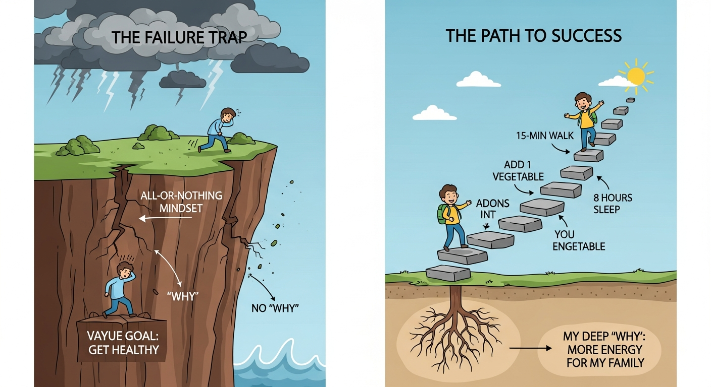

*Written by: Health Focus Research Team*
*Medically Reviewed by: Dr. Priya Sharma, MBBS, MD – Board-Certified Endocrinologist & Health Specialist*
*Last updated: February 28, 2026 | Reading time: 8 minutes*

> ⚠️ **Medical Disclaimer:** This article is for educational purposes only and is not a substitute for professional medical advice. Always consult a qualified healthcare provider.

***

## Introduction: The Promise of a Healthier You in 2026

As the calendar turns towards a new year, the familiar promise of a fresh start beckons. We envision a better version of ourselves—healthier, more energetic, and at peace. For 2026, the goal isn't just to set ambitious New Year's resolutions, but to build a foundation of well-being through simple, sustainable habits.

This isn't about a dramatic overhaul; it's about making small, intelligent choices that compound over time, creating lasting change you can actually feel.

---

### Beyond Broken Resolutions: Why This Year Will Be Different

The cycle of setting and abandoning resolutions is a common experience. We begin with a surge of motivation, only to see it fizzle out by February. The problem isn't a lack of willpower; it's the approach.

This year, we're trading guilt-ridden resolutions for a strategy grounded in the science of habit formation. We will focus on consistency over intensity, progress over perfection, and building a routine that serves your long-term health—not just a short-term goal.

---

## Why Most New Year's Resolutions Fall Short (and How to Avoid the Trap)

Before building a successful system for change, it's crucial to understand why the traditional approach so often fails. The typical New Year's resolution is practically designed for failure, built on a foundation of unrealistic expectations and flawed psychology.

By identifying these common traps, you can sidestep them in 2026.

---

### The "All or Nothing" Mindset: A Recipe for Burnout

Many resolutions are framed with rigid, unforgiving rules: *"I will go to the gym five days a week"* or *"I will never eat sugar again."* This all-or-nothing thinking creates immense pressure.

The moment you miss a gym session or eat a cookie, it can feel like total failure. This single misstep often leads to abandoning the goal altogether, reinforcing the belief that you can’t stick to your commitments.

---

### Focusing on Abstract Goals vs. Concrete Behaviors

Goals like *"get healthier"* or *"reduce stress"* are admirable but vague. They lack a clear, actionable path.

Without a specific behavior—such as *"take a 15-minute walk during lunch"*—the goal remains an abstract wish. Lasting change is built on concrete actions, not broad aspirations.

---

### Lack of a Deeply Rooted "Why"

Resolutions driven by social pressure or fleeting motivation rarely last. A goal to *"lose 10 pounds"* is less powerful than a desire to *"have more energy for daily life"* or *"support long-term heart health."*

A meaningful personal reason is what sustains habits when motivation fades.

---

## The "Anti-Resolution" Approach: Micro-Habits for Macro-Results

The key to a healthier 2026 lies in rejecting extreme resolutions and embracing small, incremental changes.

This anti-resolution approach focuses on micro-habits—actions so small they’re easy to repeat—creating momentum that leads to lasting improvements in wellbeing.

---

### The Science of Small Wins

Completing small habits releases dopamine, reinforcing positive behavior. Over time, these small wins reshape identity—you stop *trying* to be healthy and start *living* healthfully.

---

### Effortless Integration Through Habit Stacking

Habit stacking pairs a new habit with an existing routine.

Example:
- After brushing your teeth → take five deep breaths

This removes friction and makes habits automatic.

---

### Flexibility Over Perfection

Missed days aren’t failures. Micro-habits make restarting easy and encourage self-compassion. Consistency matters more than perfection.

---

## Foundational Habits for a Thriving 2026

Long-term wellbeing rests on a few core pillars: rest, hydration, nutrition, and movement.

---

### Prioritizing Rest

Sleep supports energy, focus, immunity, and mood. Begin by shifting bedtime by just 15 minutes and creating a calming evening routine.

---

### Hydration as a Daily Reset

Drinking a glass of water in the morning is one of the simplest habits to support energy and focus. Keep water nearby throughout the day as a visual cue.

---

### Mindful Nutrition

Instead of restriction, focus on nourishment. Adding vegetables, eating regular meals, and prioritizing protein supports sustainable health.

---

### Movement as Care, Not Punishment

Movement should feel supportive, not forced. A daily walk, gentle stretching, or enjoyable activities like yoga or dancing can make consistency easy.

---

## Cultivating Mental and Emotional Wellbeing

True health includes emotional balance and stress management.

---

### Mindful Moments

Brief breathing exercises, pauses between tasks, or time outdoors help calm the nervous system and reduce daily stress.

---

### Gratitude and Positive Awareness

Noticing one positive moment each day trains the mind toward resilience and emotional balance.

---

### Digital Boundaries

Reducing screen time before bed improves sleep quality and mental clarity.

---

## Making Habits Stick Long-Term

Tracking progress, seeking support, and reframing setbacks as feedback help habits last.

Celebrate small wins and adjust when needed—habits evolve with life.

---

## Your Personal Habit Blueprint for 2026

Start with one or two focus areas. Apply the two-minute rule to overcome resistance and remember this is a lifestyle—not a deadline.

---

## Conclusion

A healthier 2026 isn’t built on extreme resolutions—it’s built on small, repeatable choices.

One glass of water.  
One walk.  
One mindful breath.

Choose your first habit today and begin creating a routine that supports your wellbeing far beyond January.

---

### Medical Disclaimer

*This content is for informational purposes only and does not constitute medical advice. Always consult a qualified healthcare professional for personal health concerns.*
