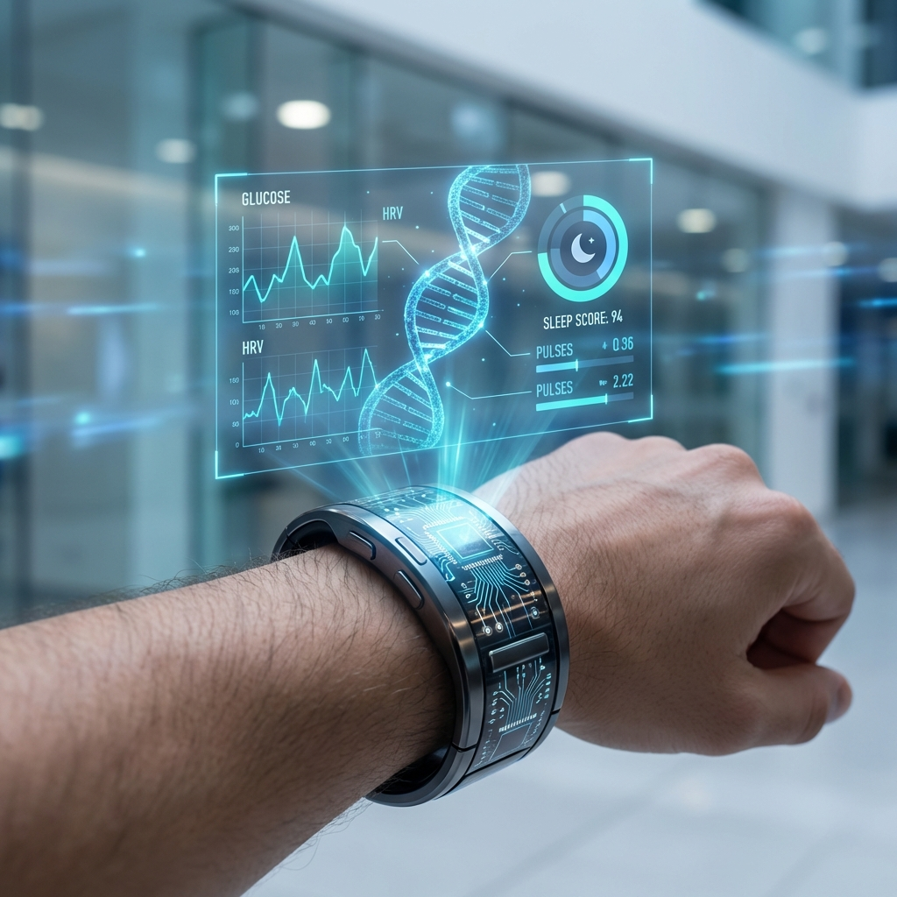

*Written by: Health Focus Research Team*
*Medically Reviewed by: Dr. Anika Patel, MD – AI & Precision Medicine Specialist*
*Last updated: May 3, 2026 | Reading time: 18 minutes*

> ⚠️ **Medical Disclaimer:** This article is for educational purposes only. Always consult a qualified healthcare provider.

---

## The AI Health Revolution Is Here

In 2026, artificial intelligence has moved from science fiction to everyday healthcare. AI is now helping people detect diseases earlier, optimize their longevity, and receive truly personalized health recommendations like never before.

This isn’t about replacing doctors — it’s about giving you and your healthcare team smarter tools powered by data.

## Why AI in Health Matters More Than Ever

Traditional medicine often works on averages. AI changes that by analyzing **your unique biology** in real time. This shift from one-size-fits-all to truly personalized care is one of the biggest medical revolutions of our time.

### The Problem with Old-School Healthcare

Most doctors still rely on general guidelines. But two people with the same symptoms can have completely different root causes. AI helps bridge that gap by looking at thousands of data points simultaneously.

## Top AI Health Trends in 2026

### 1. Multi-Omics AI Analysis
Companies are combining your genetics, gut microbiome, blood markers, and even voice patterns to create highly accurate health profiles.

**Benefits:**
- Predict disease risk years in advance
- Calculate your true biological age
- Get supplement and diet plans made specifically for your body

### 2. Predictive Health Monitoring
New AI systems analyze data from wearables 24/7 and can spot problems weeks before you feel any symptoms. This is especially powerful for heart disease, diabetes, and mental health issues.

### 3. Dynamic Longevity Protocols
AI now creates real-time plans for NAD+, peptides, fasting windows, and exercise timing based on your latest biomarkers. This means your anti-aging strategy can change week by week based on real data.

### 4. AI for Mental & Nervous System Health
Voice analysis and sleep data are being used to detect early signs of anxiety, burnout, and nervous system dysregulation. This is becoming one of the fastest-growing areas in AI health.

## Best AI Health Tools Right Now (2026)

- **Function Health** – Best overall blood + AI insights
- **Levels Health** – Excellent for metabolic health
- **InsideTracker** – Great for longevity optimization
- **Viome** – Best gut microbiome analysis

## How to Start Using AI for Your Health (Step-by-Step Guide)

1. **Get a comprehensive blood panel** (Function Health is highly recommended)
2. **Use a continuous glucose monitor** for 2–4 weeks
3. **Combine the data** with a doctor who understands both traditional and AI-driven medicine
4. **Focus on fundamentals first** — sleep, protein, and strength training. AI works best on top of good basics
5. **Review your data monthly** and adjust your plan accordingly

## Real-World Results People Are Seeing

Many users report:
- 30–50% improvement in energy levels within 8 weeks
- Significant reduction in brain fog
- Better sleep quality
- More accurate supplement choices (less money wasted)

## The Future Looks Personalized

By 2028, experts believe AI will be central to most preventive healthcare. The people who start using these tools now will have a significant advantage in health and longevity.

---

*This content is for informational purposes only and does not constitute medical advice.*