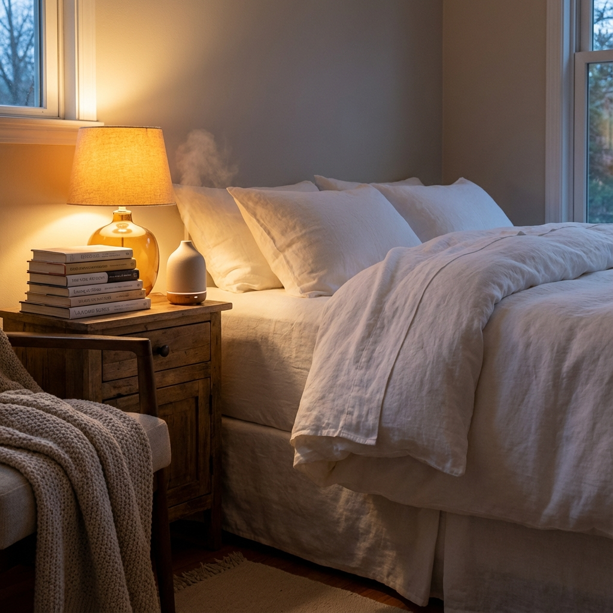

## Real Talk: Why You Should Actually Care About This

Look, I get it. You open Instagram and suddenly everyone's an expert telling you to drink celery juice at 5am, take ice baths, or try some sketchy weight-loss shot their "coach" recommended. Meanwhile, your best friend swears by her new gut health protocol, and your mom's asking if you've tried that peptide thing she saw on TikTok.

It's exhausting.

Here's the thing: wellness culture in 2026 is having a bit of an identity crisis. Half of us are finally getting back to basics—prioritizing sleep, moving our bodies, cutting back on the wine we've been leaning on since 2020. The other half? Still chasing quick fixes that promise six-pack abs in two weeks or a "miracle cure" for everything from anxiety to aging.

So I put together this guide to help you figure out what's actually worth your time (and money), what to approach carefully, and what to straight-up avoid. Think of me as your skeptical friend who actually reads the studies so you don't have to.

---

## The Stuff That Actually Works (AKA The Boring-But-Effective Zone)

These aren't sexy. They won't go viral. But they work. Like, actually work.

### 1. Focus on Sleep—Seriously, Just Sleep Better

Remember when we all pretended sleep was optional? Yeah, that era's over. The American Heart Association literally put it in their "Life's Essential 8" framework alongside diet and exercise—because it turns out sleep affects *everything*. Your mood, your immune system, your ability to not snap at your coworker who microwaves fish in the office kitchen.

**What to actually do:**
Start stupidly small. Pick a consistent bedtime and stick to it for two weeks. That's it. Don't try to overhaul your entire life on January 1st with ten resolutions. Just fix your sleep schedule and maybe aim for 8,000 steps a day (not 10,000—that number was literally made up by a Japanese marketing company in the 1960s, true story).

Track it lightly if you want, but don't get obsessive. The goal is progress, not perfection.

### 2. "Damp January"—Because Going Cold Turkey Isn't for Everyone

Dry January is great if you're into it, but let's be honest: Most of us fall off the wagon by January 15th and then feel like failures. Enter "Damp January"—just drinking less, not necessarily nothing at all.

Even moderate cuts make a difference. We're talking better sleep, clearer skin, improved mood, and yeah, your jeans might fit a little better. According to folks who track this stuff, you'll notice changes in about two weeks.

**What to actually do:**
Set some booze-free days during the week (like Monday through Wednesday), and when you do drink, cap it at two. Make it easier on yourself by finding a good ritual replacement—fancy sparkling water with lime, a decent non-alcoholic beer (they're way better now than they used to be), or herbal tea if you're into that.

The goal isn't to become a wellness warrior. It's just to feel better.

### 3. Lift Heavy Things (Or At Least Do Some Push-Ups)

If all the wellness noise is making your head spin, here's your simplified version: **Strength training + walking + sleep = your anti-aging trifecta.**

You don't need a gym membership or a personal trainer. Bodyweight exercises in your living room work. The point is building muscle and bone density so you can keep doing the stuff you love as you get older—like playing with your kids, hiking with friends, or just getting up off the floor without grunting.

This is especially crucial if you're over 30, when we naturally start losing muscle mass. Fun times.

---

## The "Maybe, But Be Smart About It" Zone

These have some legitimate benefits, but the hype train has left the station. Proceed with caution and a healthy dose of skepticism.

### 1. Cold Plunges and Saunas—Not the Magic Bullet TikTok Promised

Ice baths and saunas can feel amazing. They might help with stress resilience and give you a nice endorphin rush. But social media will have you believe they'll cure your anxiety, fix your metabolism, and probably also solve climate change.

Reality check: Benefits vary wildly from person to person.

**Be careful if:**
- You have heart issues, uncontrolled blood pressure, or you're pregnant
- You deal with panic attacks (sudden cold can trigger them)
- You already have sleep issues (paradoxically, cold plunges can mess with sleep for some people)

Start with 30 seconds if you try it. Work your way up. And if it makes you feel worse? Just stop. You're not failing at wellness—it's just not for you.

### 2. Gut Health Stuff—Mostly Legit, But the Supplement Aisle Is a Scam

Yes, your gut health matters. It affects your mood, digestion, immunity—all of it. But here's the thing: most of those expensive probiotic supplements? They're basically fancy marketing.

**What actually works:**
Go food-first. Eat fiber-rich vegetables, fermented foods like yogurt or kimchi, and try to hit 30 different plant types a week (sounds harder than it is—herbs and spices count).

Probiotics can be helpful for specific issues like IBS, but those one-size-fits-all gut health protocols? Mostly just emptying your wallet.

---

## The "Absolutely Not" Zone (AKA Please Don't Do These Things)

These are tempting because they promise fast results. But they're dangerous, unregulated, or just straight-up scams.

### 1. Those Sketchy Weight-Loss Shots You See on Instagram

You know the ones I'm talking about. "Research-grade" GLP-1 drugs, knockoff Ozempic from random websites, compounded versions that arrive in unmarked vials. They're everywhere, and they're terrifying.

The FDA has put out multiple warnings about these. The problems? Unknown purity, incorrect dosing, contamination, infections—the list goes on. In the UK, the MHRA is cracking down on the same stuff.

**Why this is genuinely dangerous:**
Real GLP-1 drugs (like actual, prescribed Ozempic or Zepbound) already come with risks when used properly—nausea, potential pancreatitis, kidney issues from dehydration. Now imagine using a contaminated or incorrectly dosed version from some random website. It's not worth it.

**Do this instead:**
If you're struggling with weight, talk to an actual doctor. Focus on sustainable changes—eating a bit less, moving a bit more. I know that's not the exciting answer you wanted, but it's the one that won't land you in the ER.

### 2. Supplements That Promise Medical Miracles

If a supplement claims it'll cure your fatigue, prevent disease, or basically do anything that sounds medical, it's probably illegal. The UK's Advertising Standards Authority is going after brands for these bogus claims, and in the US, the FTC has similar rules.

**The red flag test:**
Does it sound too good to be true? It is. Does it promise specific medical results without FDA approval? It's lying. Are the before-and-after photos suspiciously perfect? Yeah, those are fake.

### 3. Extreme Fasting and Restriction Cycles

Regular intermittent fasting? Fine for some people. But these ultra-restrictive versions—like 48-hour fasts every week—are just rebranded eating disorders. They wreck your hormones, tank your sleep, spike anxiety, and set you up for the classic yo-yo diet cycle.

Sustainable eating beats extreme restriction every single time.

---

## Your Quick Scam-Spotting Checklist for 2026

Before you buy that thing your favorite influencer is pushing:

1. **Where's it from?** Pharmacy with a prescription = good. Random website shipping unmarked vials = absolutely not.

2. **What's it claiming?** "Guaranteed 20 pounds in a week" = scam. Real results take time and look different for everyone.

3. **Is it regulated?** In the US, look for FDA approval. In the UK and Europe, check for MHRA/MCA approval. No stamp? No thanks.

4. **Would your doctor be cool with this?** If the answer is "I'd be too embarrassed to tell them," that's your sign.

---

## The Bottom Line

Stick with the boring stuff in the first section. Get better sleep. Move your body. Cut back on booze if you want. Lift some weights. That's it. That's the formula.

Everything else is optional or potentially problematic. You don't need to optimize every aspect of your existence to be healthy. You just need to nail a few basics consistently.

What's one wellness thing you're actually going to try in 2026? (And what wellness trend are you finally giving up?) Let me know in the comments.

---

**Sources:**
- American Heart Association: Life's Essential 8
- Alcohol Change UK: Dry January Benefits  
- FDA Warnings on Unapproved GLP-1s
- FDA Safety Labels: Semaglutide (Ozempic) and Tirzepatide (Zepbound)
- UK ASA: Food, Drink, and Supplement Claims
